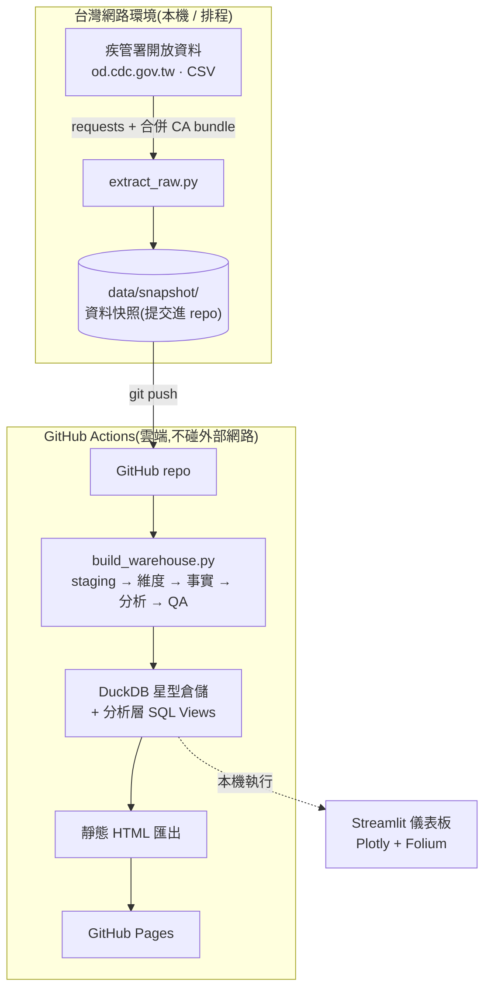
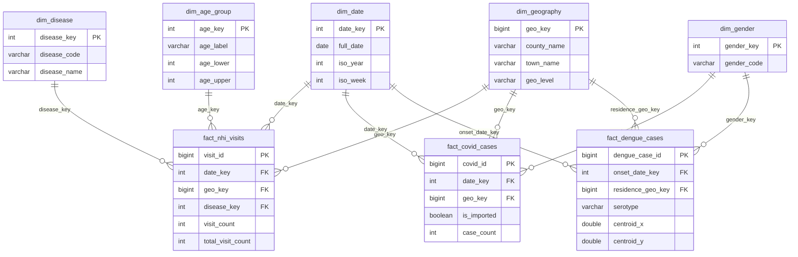

# 🦟 台灣傳染病資料工程專案 · tw-disease-data

> 從**疾管署開放資料**到**互動儀表板**的端到端資料工程管線 —— 擷取、星型建模、分析、視覺化、自動部署。
> 涵蓋流感、腸病毒、COVID-19、登革熱,約 **67 萬筆事實資料**,時間跨度 **1998–2026**。


---

## 這個專案展示什麼

- **資料工程,而非一次性分析** —— 分層架構(raw → snapshot → 星型倉儲)、資料快照版本化、CI/CD 自動建置與部署。
- **維度建模** —— 星型 schema(5 共用維度 + 3 依粒度切分的事實表),外鍵強制參照完整性。
- **真實世界的髒資料處理** —— 三來源的年齡層格式、性別髒值、境外移入編碼、跨系統地理代碼,全部在 ETL 標準化。
- **分析型 SQL** —— 用視窗函數做移動平均、週/月增長率、地區排名,並以密集時間骨架處理稀疏序列。
- **視覺化** —— Streamlit + Plotly + Folium 互動儀表板,配色經無障礙(CVD)驗證。
- **務實的基礎設施決策** —— 疾管署主機封鎖雲端 IP,故將**擷取**(需台灣網路)與 **CI/CD 建置部署**分離。

## 系統架構

疾管署開放資料主機對非台灣 / 雲端 IP 有防火牆限制,GitHub Actions runner 無法直接抓取。
因此**擷取**在有台灣網路的環境執行、提交資料快照;**建置與部署**由 GitHub Actions 從快照完成(不碰網路)。



## 技術棧

| 層 | 技術 |
|---|---|
| 擷取 | Python · `requests` · `certifi`(跨平台 TLS) |
| 儲存 / 倉儲 | Parquet(快照)· **DuckDB**(星型倉儲) |
| 轉換 / 分析 | SQL(staging views、視窗函數)· pandas |
| 視覺化 | **Streamlit** · **Plotly** · **Folium** |
| 自動化 / 部署 | **GitHub Actions**(CI + 建置部署)· GitHub Pages |

## 資料來源

全部取自疾管署開放資料平台(`od.cdc.gov.tw`),CSV 直接下載,**無需爬蟲**。

| 疾病 | 來源檔 | 粒度 | 事實筆數(約) |
|---|---|---|---|
| 流感 | `NHI_Influenza_like_illness.csv` | 週 × 縣市 × 年齡 | ~186k |
| 腸病毒 | `NHI_EnteroviralInfection.csv` | 週 × 縣市 × 年齡 | ~186k |
| COVID-19 | `Age_County_Gender_19CoV.csv` | 月 × 縣市/鄉鎮 × 性別/年齡 | ~187k |
| 登革熱 | `Dengue_Daily.csv` | 逐筆個案(含經緯度) | ~108k |

## 星型資料模型

三種粒度不同 → 拆成三張事實表(標準做法),共用同一組維度。所有事實表以「期間起始日」
(週→週一、月→月初、個案→發病日)對到單一 `dim_date`,`period_type` 標明原始粒度。



## 分析層(SQL Views)

建於 [`sql/40_analytics.sql`](sql/40_analytics.sql)。關鍵設計:週資料為**稀疏序列**(某縣市某週零病例=無列),
先鋪**密集時間骨架 zero-fill**,視窗函數的移動平均/增長率才不會跨過空缺算錯。

| View | 分析 |
|---|---|
| `v_weekly_trend` | 4/8 週移動平均 + 週增長率(WoW)+ 就診率 |
| `v_county_rank_weekly` | 地區排名 + 占全國比例 |
| `v_covid_monthly_trend` | 3 月移動平均 + 月增長率(MoM) |
| `v_covid_county_rank` | COVID 地區排名 |

## 視覺化

[`app.py`](app.py) 互動儀表板,三分頁:📈 趨勢與移動平均 · 🏆 地區排名 · 🗺️ 登革熱熱區。
設計依 dataviz 原則:**單一 Y 軸**、類別色固定順序、熱區單一藍色相漸層、移動平均以線寬區分。

## ✅ 數字對得上真實疫情史(不只是能跑)

以已知疫情事件反向驗證,證明清理與建模正確:

| 驗證 | 結果 |
|---|---|
| **2015 台南登革熱大流行** | `v_weekly_trend` 重現爆發曲線(第 34→38 週 1,151→3,571) |
| **登革熱地區排名(2015 高峰)** | 台南第 1(占全國 **74.5%**)、高雄第 2 —— 符合南部雙市疫情 |
| **COVID Omicron 起漲** | 2022-04 新北月增長 **+7,329%**、台北 +5,900% |
| **移動平均跨年邊界** | 手算對照吻合,且正確納入前一年週次 |

## 快速開始

```bash
pip install -r requirements.txt

python src/build_warehouse.py    # 從已提交的快照建倉:staging → 維度 → 事實 → 分析 → QA
streamlit run app.py             # 互動儀表板

# 更新資料(需台灣網路):擷取 → 更新 data/snapshot/
python src/extract_raw.py
```

## 自動化(GitHub Actions)

| Workflow | 觸發 | 做什麼 |
|---|---|---|
| [`ci.yml`](.github/workflows/ci.yml) | push / PR | 從快照重建 + QA + 匯出,確保管線沒被改壞(不碰網路) |
| [`refresh-and-deploy.yml`](.github/workflows/refresh-and-deploy.yml) | push 快照 / 每週一 / 手動 | 從快照重建 → 部署 GitHub Pages + 上傳 `warehouse.duckdb` |

**資料更新流程**:在台灣網路環境跑 [`scripts/refresh_local.ps1`](scripts/refresh_local.ps1)
(可掛 Windows 工作排程器)→ 擷取最新資料、commit 快照、push → 自動觸發重建與部署。
詳見 [`DEPLOY.md`](DEPLOY.md)。

## 🛠 工程亮點(值得一聊的決策)

- **雲端 IP 封鎖 → 擷取/部署分離**:疾管署主機防火牆擋掉 GitHub Actions 的雲端 IP,
  runner 抓不到資料。故擷取在台灣網路端執行並提交**資料快照**,CI/CD 只從快照建置部署 ——
  這也讓 CI 不依賴外部服務,穩定可重現(本就是好的 CI 設計)。
- **跨平台 TLS**:CDC 未附中間憑證。Windows/macOS 靠 AIA 自動補齊,Linux/OpenSSL 不會 ——
  故 repo 內建 [`certs/twca_ssl_intermediate.pem`](certs/) 併入 certifi CA bundle。
- **地理以縣市名 conform**:三來源代碼系統不同(健保碼 vs 內政部碼),硬用代碼 join 對不起來。
- **年齡層正規化**:分隔符 `~`/`-` 統一後才能對齊 COVID 與登革熱分桶,同時保留流感粗分桶。
- **避免重複計數**:建倉只綁每資料集的最新快照成 `raw_*` 視圖,不用 glob 掃進多版本。

## 已知資料限制

- **登革熱經緯度僅 2021 年起提供**(全體約 26%,集中在 2023 疫情年的 26,691 筆),
  故點圖只能畫近年;縣市層級趨勢/排名可用全量(1998–)。
- **登革熱血清型約 87% 未填**(多為境外移入/未定型),分析前需過濾。
- 流感/腸病毒就診類別僅 `住院`/`門診`(無單獨急診欄)。

## 專案結構

```
tw-disease-data/
├── src/
│   ├── extract_raw.py       擷取 → data/snapshot/(跨平台 TLS)
│   ├── build_warehouse.py   orchestrator:staging → 維度 → 事實 → 分析 → QA
│   └── viz/                  data.py / charts.py / theme.py(與 Streamlit 解耦)
├── sql/                     schema + staging + dims + facts + analytics
├── app.py                   Streamlit 儀表板
├── scripts/
│   ├── export_static.py     匯出獨立 HTML(GitHub Pages)
│   └── refresh_local.ps1    本機刷新:擷取 → commit 快照 → push
├── data/snapshot/           資料快照(提交進 repo,CI 由此建置)
├── certs/                   CDC 中間憑證(TLS 需要)
└── .github/workflows/       ci.yml · refresh-and-deploy.yml
```

---

*資料來源:衛生福利部疾病管制署開放資料平台。本專案僅供學習與作品集展示。*
